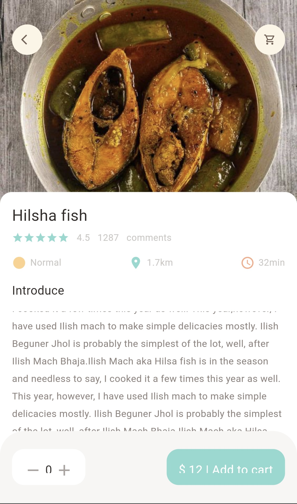
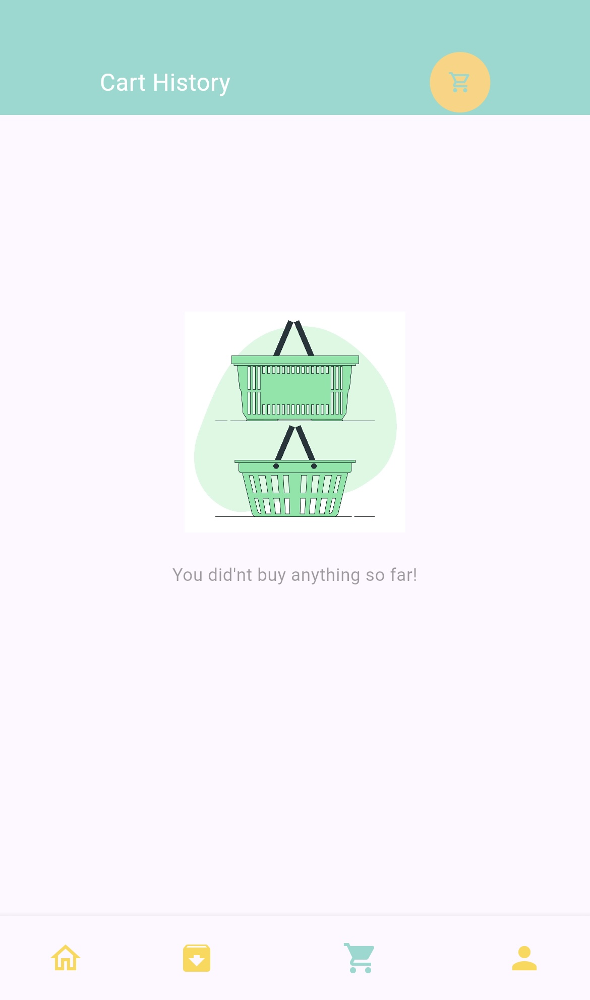
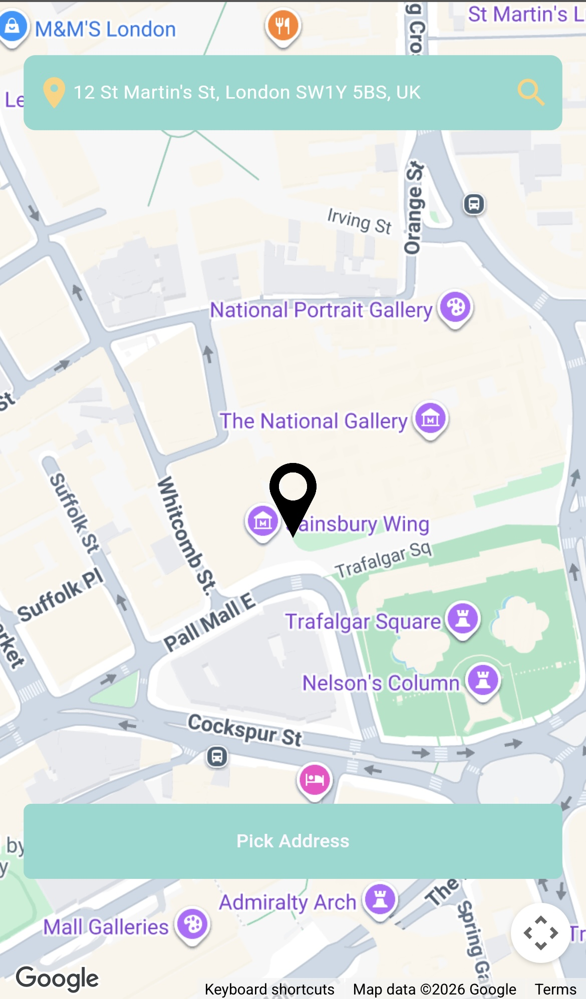
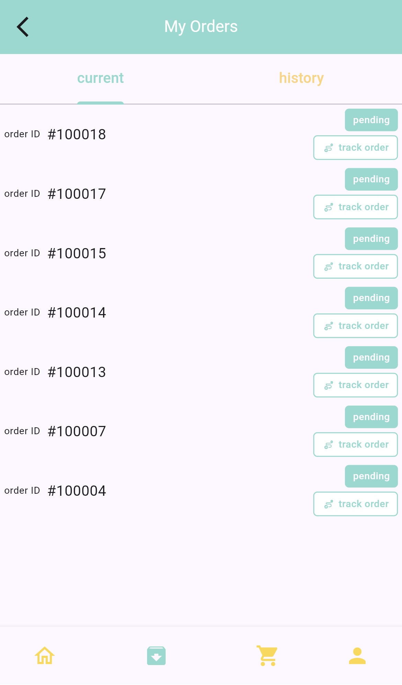
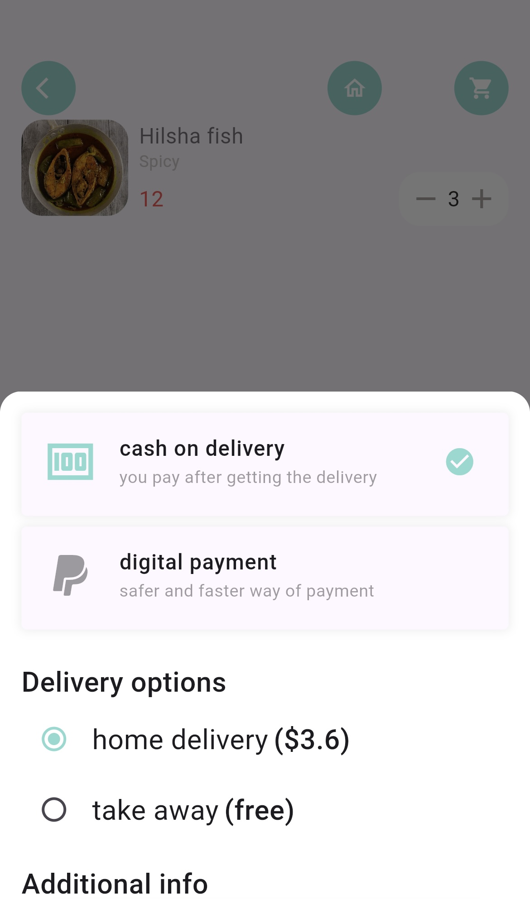

# DBFood — Food Delivery App

A full-featured food delivery mobile and web application built with Flutter. Users can browse popular and recommended dishes, manage a cart, pick a delivery address on Google Maps, place orders, and pay through an integrated payment gateway — all with real-time push notifications powered by Firebase.

**Live demo:** [food-delivery-app-ce205.web.app](https://food-delivery-app-ce205.web.app)

---

## Background

This project started as a follow-along tutorial to learn Flutter fundamentals, then grew into an independently extended application. Beyond the tutorial baseline, the following were built out independently:

- Google Maps address picker with Places API autocomplete
- Firebase Cloud Messaging integration for push notifications
- Payment gateway redirect flow
- Deployment of the backend API to Railway
- Additional features in progress

---

## Features

- **Splash screen** with automatic auth state detection
- **Authentication** — sign up and sign in with token-based sessions
- **Home feed** — animated carousel of popular dishes and recommended food list
- **Food detail pages** — description, quantity selector, add to cart
- **Cart** — add/remove items, view order summary, cart history
- **Address management** — pick delivery location on Google Maps with place search autocomplete and geocoding
- **Order placement** — choose delivery option and payment method
- **Order tracking** — current and past orders in tabbed view
- **Payment gateway** — redirects to hosted payment page on order confirmation
- **Push notifications** — Firebase Cloud Messaging for order status updates

---

## Screenshots

| Home | Food Detail | Cart |
|---|---|---|
|  |  |  |

| Address Picker | Orders | Payment |
|---|---|---|
|  |  |  |

---

## Tech Stack

| Layer | Technology |
|---|---|
| UI / Framework | Flutter (Dart) |
| State management & routing | GetX |
| Maps & location | Google Maps Flutter, Geolocator, Geocoding |
| Push notifications | Firebase Cloud Messaging + flutter_local_notifications |
| Backend API | Laravel (PHP) on Railway |
| Local storage | SharedPreferences |
| HTTP client | http |

---

## Getting Started

### Prerequisites

- Flutter SDK (3.x)
- Dart SDK
- A Google Maps API key
- Firebase project with FCM enabled

### Installation

```bash
git clone https://github.com/J-arobo/your-repo-name
cd your-repo-name
flutter pub get
```

Then configure the following:

- Set your `BASE_URL` in `lib/utils/app_constants.dart` to point to the Railway backend
- Add your Google Maps API key to:
  - `android/app/src/main/AndroidManifest.xml`
  - `ios/Runner/AppDelegate.swift`
  - `web/index.html` (for web builds)
- Add your `google-services.json` (Android) and `GoogleService-Info.plist` (iOS) from your Firebase project

### Running the app

```bash
# Run on Chrome (web)
flutter run -d chrome

# Run on iOS simulator
flutter run -d "iPhone 16"

# Build for web deployment
flutter build web
```

---

## Project Structure

```
lib/
├── controllers/        # GetX controllers (auth, cart, order, location, products, user)
├── data/
│   ├── API/            # HTTP client and API response checker
│   └── repository/     # Data layer — one repo per feature
├── models/             # Dart data models (product, cart, order, address, user…)
├── pages/              # Screens organised by feature
│   ├── auth/           # Sign in & sign up
│   ├── home/           # Main feed and food page body
│   ├── food/           # Popular and recommended food detail
│   ├── cart/           # Cart and cart history
│   ├── address/        # Add address and map picker
│   ├── order/          # Order page, delivery options, view orders
│   ├── payment/        # Payment redirect and order success
│   ├── account/        # User account page
│   └── splash/         # Splash screen
├── base/               # Shared UI components (app bar, buttons, loaders, snackbar)
├── widgets/            # Reusable widgets (BigText, SmallText, AppIcon…)
├── routes/             # Named route definitions (RouteHelper)
├── utils/              # Constants, colors, dimensions, text styles
└── helper/             # App dependencies init and notification helper
```

---

## Related Repositories

- [Shoping\_app\_backend](https://github.com/J-arobo/Shoping_app_backend) — Laravel REST API backend, deployed on Railway

---

## Author

**Joseph** — [github.com/J-arobo](https://github.com/J-arobo)
